## Імітаційне моделювання комп'ютерних систем
## СПм-21-2, **Сергєєв Данило Андрійович**
### Лабораторная работа №**1**. Описание имитационных моделей

 

### Выбранная модель в среде NetLogo:
[GenDrift P global](http://www.netlogoweb.org/launch#http://www.netlogoweb.org/assets/modelslib/Sample%20Models/Biology/Evolution/Genetic%20Drift/GenDrift%20P%20global.nlogo)

 

### Вербальное описание модели:
Эта модель является примером случайного выбора. 
Он показывает, что пятна, которые случайным образом обмениваются цветами, сходятся к одному цвету.
Идея, более подробно объясненная в «Опасной идее Дарвина» Деннета, состоит в том, что дрейф признаков может происходить без какой-либо конкретной цели или «давления отбора». 
В этой версии модели обмен цветом может происходить между любыми двумя участками

### Управляющие параметры:
- **Colors** количество цветов-участников

### Внутренние параметры:
- **pcolor** определяет цвет на следущем шаге

### Критерии эффективности системы:
- остаточна домінація однієї з популіцій.
- фінальна домінація популяції випадкова.

### Недостатки модели:
Движется только самолет

 

## Вычислительные эксперименты

### 1. Проведем  эксперимент с 5 цветами. Выясним есть ли закономерность во времени или в победном цвете
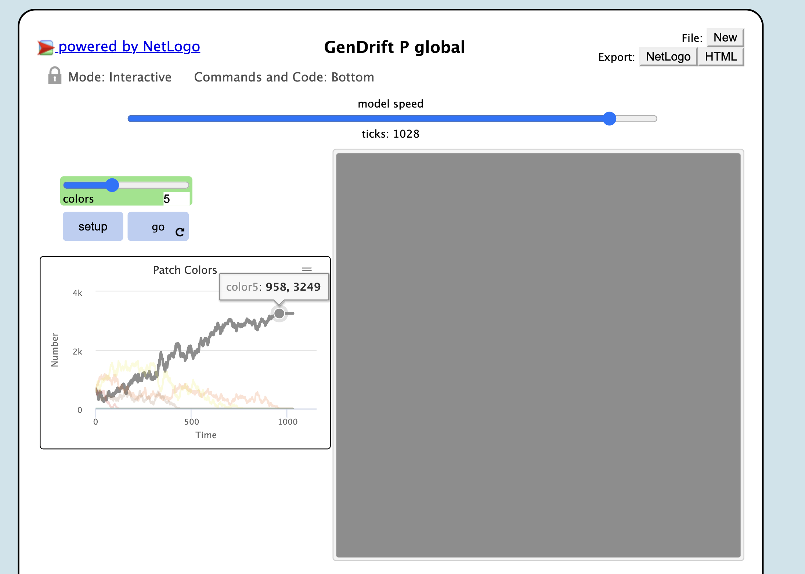
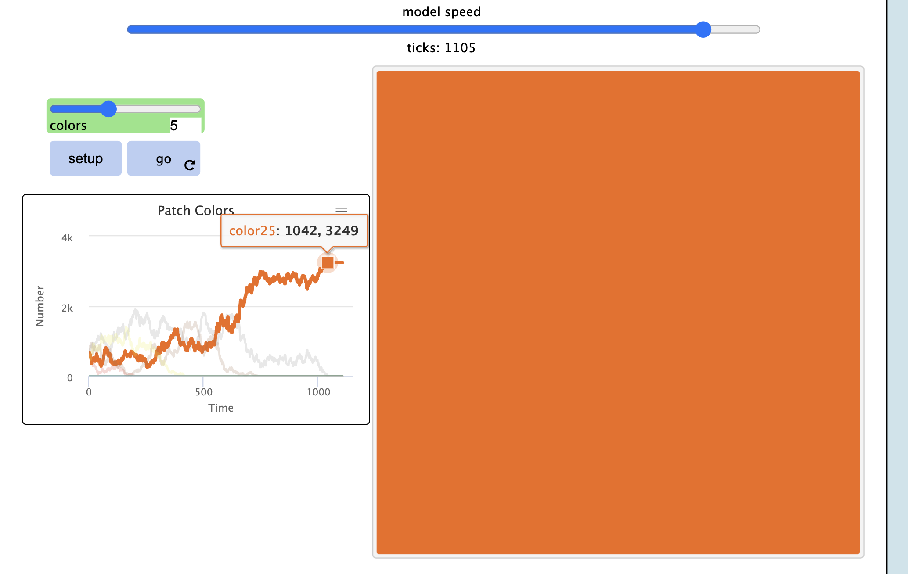
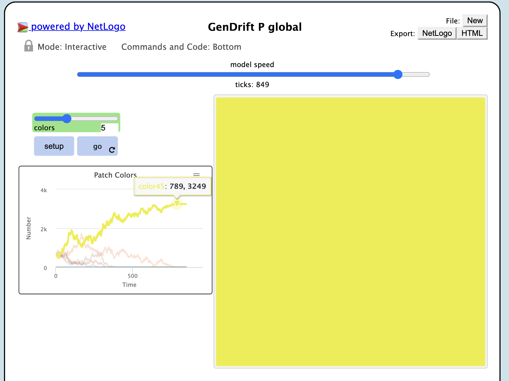

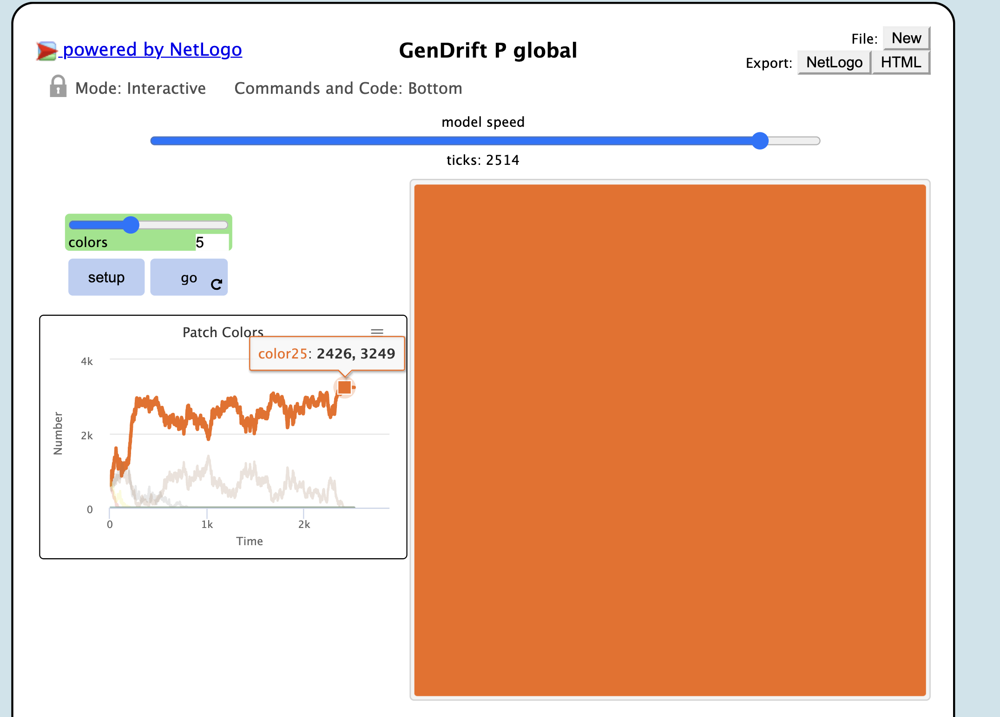
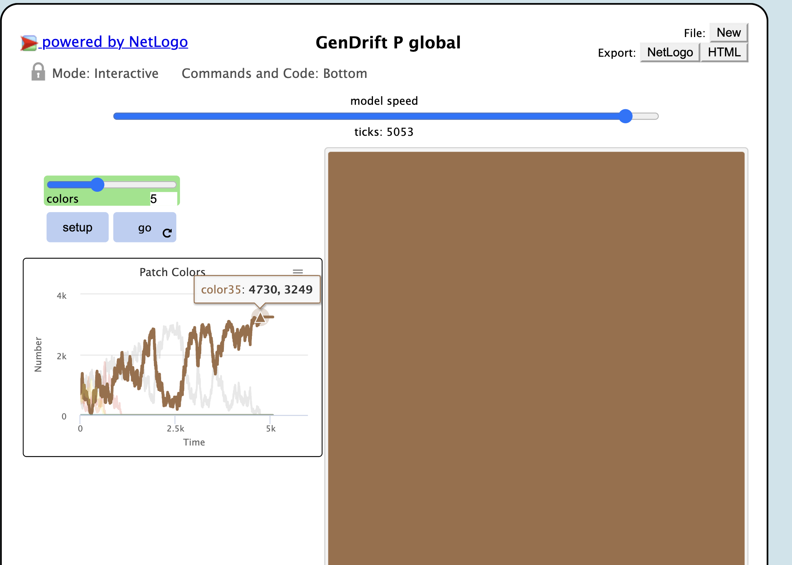

<table>
<thead>
<tr><th>Номер эксперимента</th><th>количество прошедшего времени</th></tr>
</thead>
<tbody>
<tr><td>1</td><td>958</td></tr>
<tr><td>2</td><td>1042</td></tr>
<tr><td>3</td><td>789</td></tr>
<tr><td>4</td><td>1026</td></tr>
<tr><td>5</td><td>2426</td></tr>
<tr><td>6</td><td>5553</td></tr>
</tbody>
</table>

 

### 2. Проведем  эксперимент с 2 цветами. 

 

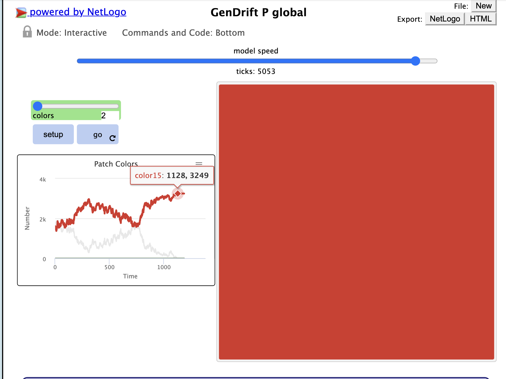
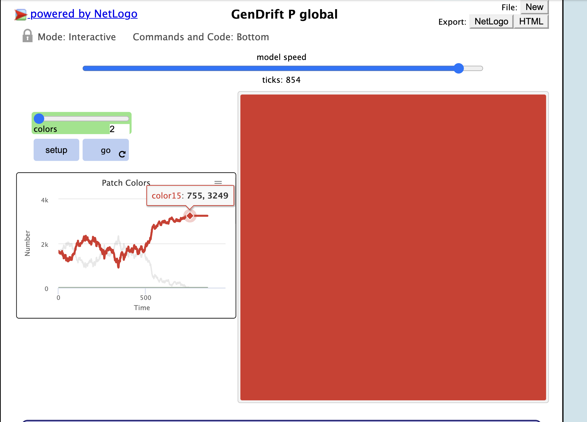
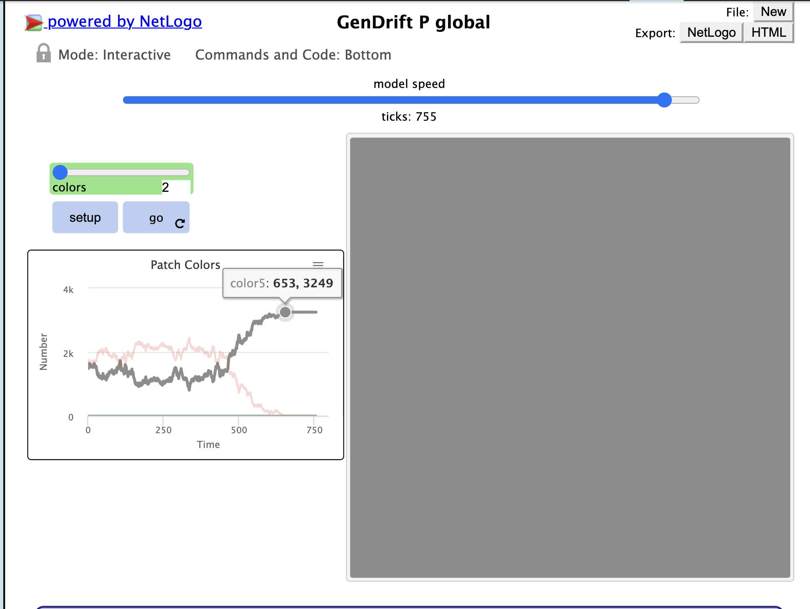

 

<table>
<thead>
<tr><th>Номер эксперимента</th><th>количество прошедшего времени</th></tr>
</thead>
<tbody>
<tr><td>1</td><td>1128</td></tr>
<tr><td>2</td><td>755</td></tr>
<tr><td>3</td><td>653</td></tr>
<tr><td>4</td><td>888</td></tr>
<tr><td>5</td><td>535</td></tr>
<tr><td>6</td><td>1254</td></tr>
</tbody>
</table>

### 3. Проведем  эксперимент с 9 цветами.
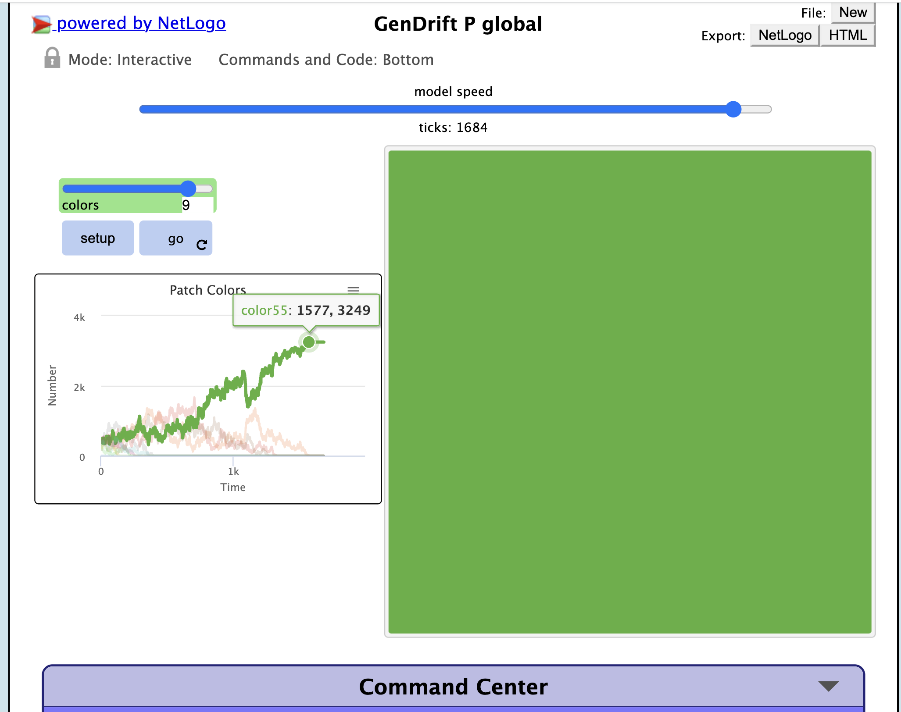
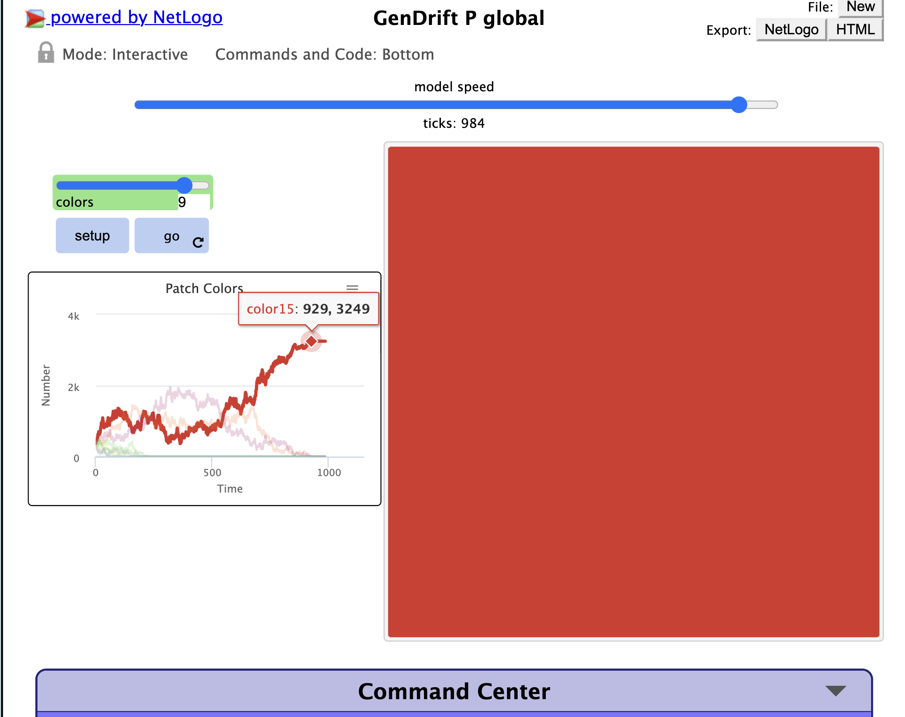
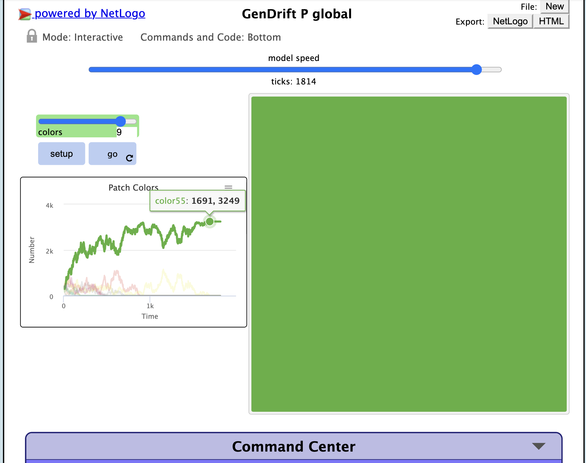

<table>
<thead>
<tr><th>Номер эксперимента</th><th>количество прошедшего времени</th></tr>
</thead>
<tbody>
<tr><td>1</td><td>1577</td></tr>
<tr><td>2</td><td>755</td></tr>
<tr><td>3</td><td>653</td></tr>
<tr><td>4</td><td>1128</td></tr>
<tr><td>5</td><td>755</td></tr>
<tr><td>6</td><td>653</td></tr>
</tbody>
</table>

Процесс сложно спрогнозировать. Итог может быть абсолютно любым
